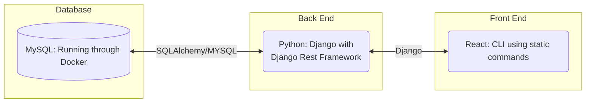
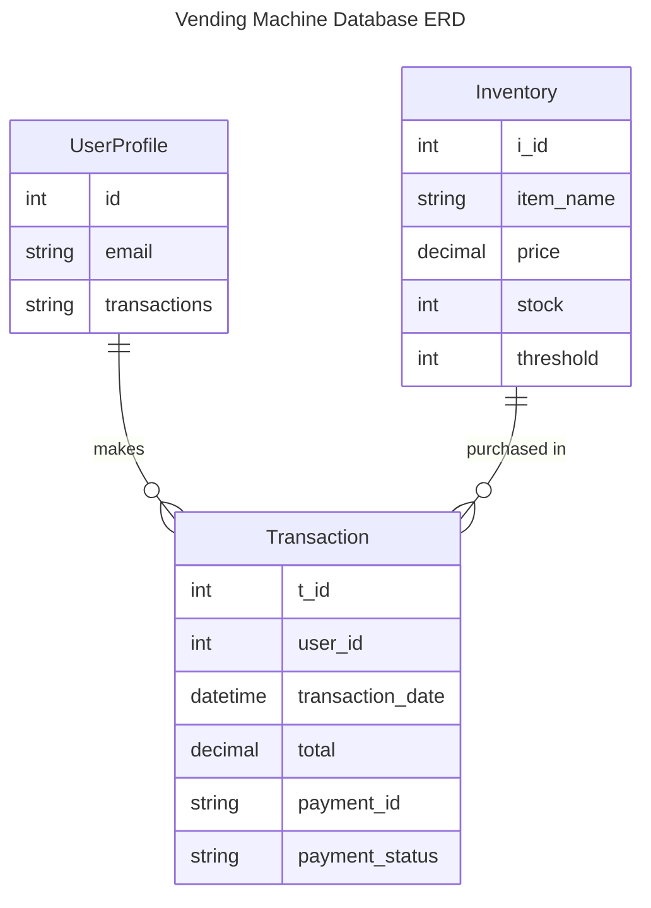
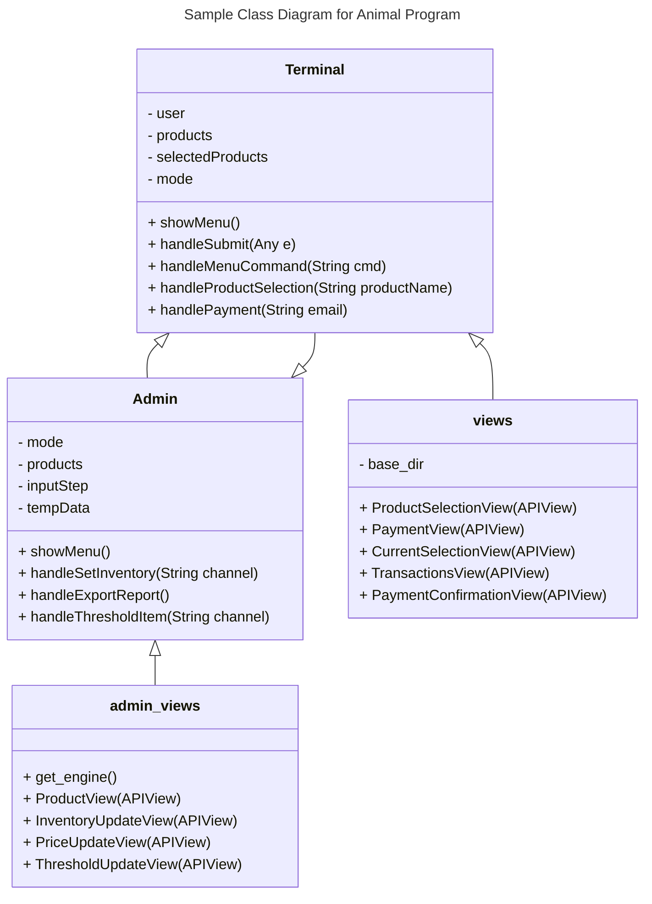
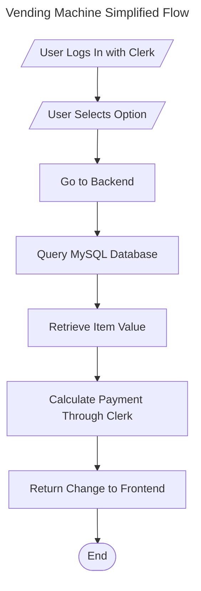
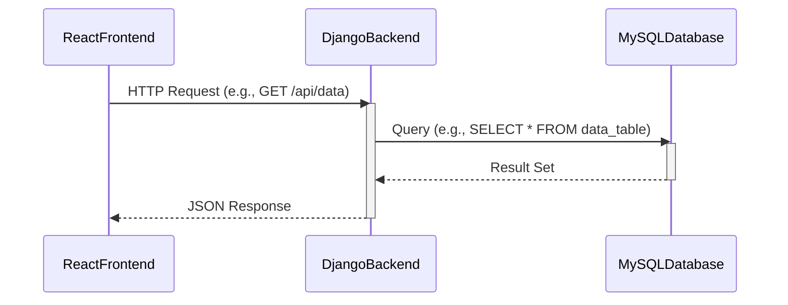
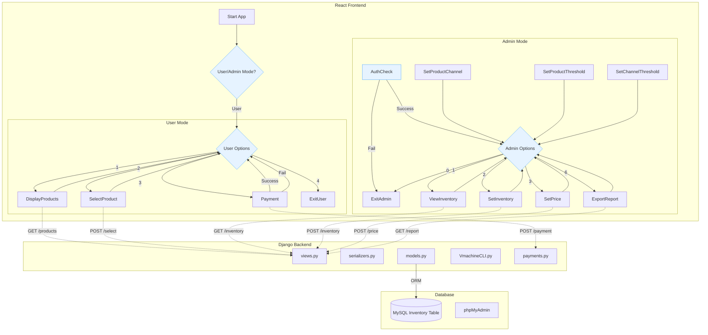

# Specification Document

## TeamName

TABLE17 VENDING COMPANY

### Project Abstract

The vending machine CLI will to allow users to purchase snacks straight from the command line. We will keep track of inventory, allow users to purchase inventory, and accept credit card payments using the [Stripe API](https://docs.stripe.com/). Stretch goals include integrating hardware such as Arduino boards and motors to create an authentic vending machine replica.

### Customer

The **Vending Machine CLI** is designed for a broad range of users who prefer a fast, command-line-based way to purchase snacks.

### Specification

#### Technology Stack

Here are some sample technology stacks that you can use for inspiration:

#### Database  

The database stores inventory, user transactions, and payment details. Below is the **Entity-Relationship Diagram (ERD)** for the Vending Machine CLI system.  

#### Class Diagram

#### Flowchart

#### Behavior

The user will press a button to decide on the specific item they want. Then the frontend UI will call a function 
from the backend. Then the backend code will get information from the database (most likely MYSQL), and get information
such as the price, item name, as well as update how many items are left. 

#### Sequence Diagram

### Standards & Conventions

[Style Guide & Conventions](STYLE.md)

### Project Requirements

- ✅ Users can interact with the vending machine through a browser-based terminal UI (`Terminal.js`).
- ✅ System must maintain real-time inventory in a MySQL database.
- ✅ Users can securely authenticate via Clerk and perform transactions.
- ✅ Payments must be processed through the Stripe API.
- ✅ Admins should be able to manage inventory via Django Admin or CLI.
- ✅ A local CLI interface (`VmachineCLI.py`) must replicate frontend terminal behavior.
- ✅ CI/CD via GitLab: build, test, and deploy pipeline with Docker containers.
- ✅ Must run locally using Docker Compose, including MySQL and phpMyAdmin.

### Project Architecture

